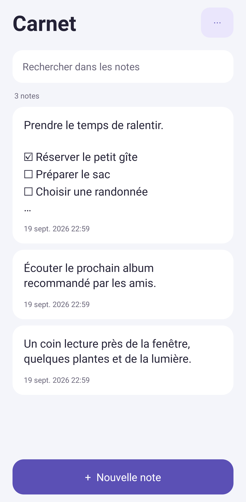
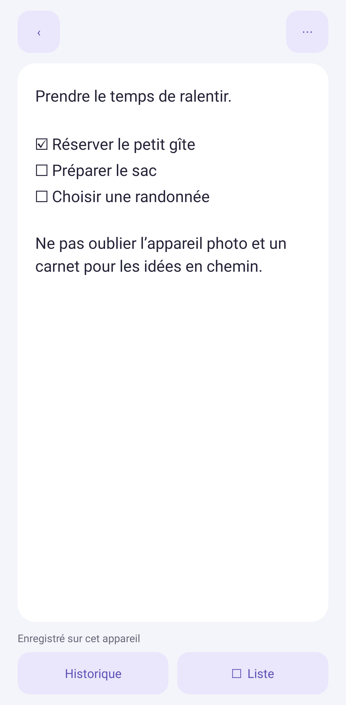
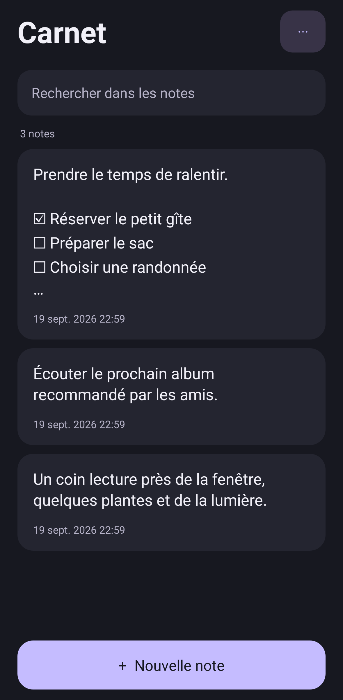

# Carnet pour Android

Un bloc-notes en français : écrivez directement, retrouvez vos notes et leurs anciennes versions.

## Installer ou mettre à jour

**[Télécharger Carnet.apk](https://github.com/nicolasght/carnet-android/releases/latest/download/Carnet.apk)** · [Toutes les versions](https://github.com/nicolasght/carnet-android/releases)

Si le téléchargement reste bloqué, essayez le **[lien de secours direct](https://raw.githubusercontent.com/nicolasght/carnet-android/main/downloads/Carnet.apk)** ou le **[fichier ZIP](https://raw.githubusercontent.com/nicolasght/carnet-android/main/downloads/Carnet-installation.zip)**. Ces liens fournissent le même APK signé. Pour le ZIP, ouvrez-le dans le gestionnaire de fichiers, extrayez-le, puis ouvrez `Carnet.apk`.

1. Ouvrez le lien depuis votre téléphone Android et téléchargez le fichier.
2. Ouvrez `Carnet.apk` et autorisez l’installation depuis votre navigateur ou votre gestionnaire de fichiers si Android le demande.
3. Installez ou mettez à jour Carnet **sans désinstaller la version précédente**, afin de conserver vos notes.

Android 8.0 ou plus récent. Aucun compte ni connexion Internet nécessaire. Les versions de distribution sont signées avec la même clé privée, conservée hors du dépôt.

<p>
  
  
  
</p>

Captures du rendu Android produites par les tests. Les exemples ne sont pas ajoutés à l’application installée.

## Utilisation

- **Nouvelle note** : écrivez directement le texte. Aucun champ de titre.
- **Enregistrement automatique** : après 650 ms de pause et lors du passage en arrière-plan.
- **Recherche** : retrouve un mot dans le contenu. Les notes récemment modifiées apparaissent en premier.
- **Supprimer** : restez appuyé sur une note, puis touchez **Supprimer**. La note et tout son historique sont effacés définitivement. **Annuler** permet de revenir à la liste sans effacer.
- **Historique** : chaque enregistrement différent devient une version datée. Restaurer une version conserve la version remplacée dans l’historique.
- **Liste** : placez le curseur sur une ligne et touchez « ☐ Liste » pour ajouter une case ou la cocher/décocher.
- **Menu d’une note** : partage du texte, duplication et suppression.
- **Apparence** : thème du téléphone, clair ou sombre.

## Mise à jour depuis la version 1.0

La version 1.1 retire les titres séparés, les favoris, la corbeille et le sous-titre de l’accueil. Les anciens titres sont intégrés au début du texte, y compris dans chaque version de l’historique. Les anciennes notes de la corbeille redeviennent des notes normales pour éviter toute perte involontaire. Les identifiants et dates sont conservés. L’import d’une ancienne sauvegarde applique la même conversion.

## Sauvegarder et changer de téléphone

Dans le menu `⋯` de l’accueil, choisissez **Exporter une sauvegarde**. Le fichier JSON inclut les notes et leurs historiques. Sur l’autre téléphone, utilisez **Importer une sauvegarde**. Les notes sont ajoutées comme nouvelles copies ; importer deux fois crée donc des doublons. Une note supprimée est absente des nouvelles sauvegardes, mais reste présente dans les fichiers exportés avant sa suppression.

Les données restent dans le stockage privé de l’application : aucun accès réseau, aucune publicité ni collecte de données. Il n’y a pas de synchronisation automatique ni de verrouillage par mot de passe intégré. Une désinstallation ou un effacement des données Android supprime les notes : exportez auparavant. Le fichier exporté n’est pas chiffré. L’import accepte les sauvegardes Carnet jusqu’à 16 Mo, 10 000 notes et 100 000 versions.

## Développement

Application native en Java, interface et base SQLite fournies par Android ; aucune bibliothèque d’exécution supplémentaire. JUnit et Robolectric servent uniquement aux tests.

Prérequis : JDK 17, Android SDK 35, Build Tools 35.0.0. Définissez `ANDROID_HOME` ou `sdk.dir` dans un fichier local `local.properties`.

```sh
./gradlew testDebugUnitTest lintDebug assembleDebug
```

Sous Windows : `gradlew.bat`. Les tests couvrent la suppression par appui long avec confirmation et annulation, la migration depuis la version 1.0, l’import des anciennes sauvegardes, l’historique, la persistance, la recherche, l’enregistrement automatique, la recréation de l’écran et Android 8.

Pour une distribution signée, définissez `CARNET_KEYSTORE` et `CARNET_STORE_PASSWORD`, avec l’alias de clé `carnet`, puis lancez `./gradlew assembleRelease`. Ne publiez jamais la clé ni son mot de passe. Les APK debug de l’intégration continue servent aux essais et ne remplacent pas une version de distribution signée.
