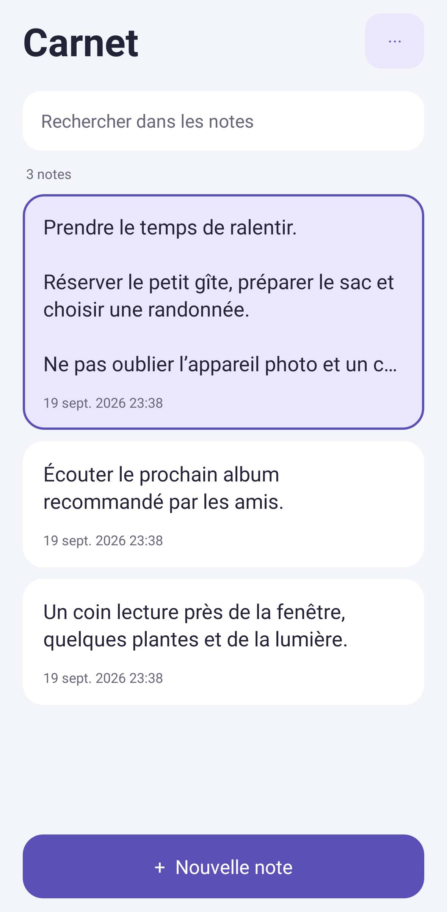

# Carnet pour Android

Un bloc-notes en français : écrivez directement, retrouvez vos notes et leurs anciennes versions.

## Installer ou mettre à jour

**[Télécharger Carnet.apk](https://github.com/nicolasght/carnet-android/releases/latest/download/Carnet.apk)** · [Toutes les versions](https://github.com/nicolasght/carnet-android/releases)

Si le téléchargement reste bloqué, essayez le **[lien de secours direct](https://raw.githubusercontent.com/nicolasght/carnet-android/main/downloads/Carnet.apk)** ou le **[fichier ZIP](https://raw.githubusercontent.com/nicolasght/carnet-android/main/downloads/Carnet-installation.zip)**. Ces liens fournissent le même APK signé. Pour le ZIP, ouvrez-le dans le gestionnaire de fichiers, extrayez-le, puis ouvrez `Carnet.apk`.

1. Ouvrez le lien depuis votre téléphone Android et téléchargez le fichier.
2. Ouvrez `Carnet.apk` et autorisez l’installation depuis votre navigateur ou votre gestionnaire de fichiers si Android le demande.
3. Installez ou mettez à jour Carnet **sans désinstaller la version précédente**, afin de conserver vos notes.

Android 8.0 ou plus récent. Les notes fonctionnent sans compte et hors connexion. Les versions de distribution sont signées avec la même clé privée, conservée hors du dépôt.

À partir de **Carnet 1.3**, ouvrez le menu `⋯` de l’accueil puis **Mises à jour**. Carnet consulte la dernière version stable sur GitHub et propose son installation. En cas d’échec du téléchargement principal, le lien de secours est essayé automatiquement. La taille, l’empreinte SHA-256, l’identité de l’application et sa signature sont vérifiées avant installation. Android peut demander d’autoriser les installations depuis Carnet, puis vous demande de confirmer la mise à jour. Vos notes sont conservées.

La version 1.3 doit être installée une première fois avec le lien ci-dessus pour disposer de ce menu. La recherche de mises à jour est manuelle. Vous pouvez continuer à écrire pendant le téléchargement ; si Android arrête complètement Carnet, relancez la recherche.

<p>
  
  
  
  
</p>

Captures du rendu Android produites par les tests. Les exemples ne sont pas ajoutés à l’application installée.

## Utilisation

- **Nouvelle note** : le curseur et le clavier s’ouvrent automatiquement. Aucun champ de titre.
- **Note existante** : elle s’ouvre sans clavier. Touchez le texte pour écrire.
- **OK** : le bouton reste au-dessus du clavier, enregistre immédiatement et ferme la note.
- **Notes vides** : un brouillon vide ou composé seulement d’espaces n’est jamais enregistré. Si vous videz une note existante, sa dernière version reste conservée pendant la frappe ; **OK** ou le retour à l’accueil supprime cette note et son historique.
- **Enregistrement automatique** : après 650 ms de pause et lors du passage en arrière-plan.
- **Recherche** : retrouve un mot dans le contenu. Les notes récemment modifiées apparaissent en premier.
- **Supprimer** : restez appuyé sur une note. Un contour coloré l’entoure avant la confirmation. **Supprimer** efface définitivement la note et son historique. **Annuler** retire la sélection.
- **Historique** : accessible depuis le menu `⋯` de la note. Chaque enregistrement différent devient une version datée. Restaurer une version conserve la version remplacée dans l’historique.
- **Menu d’une note** : historique, partage du texte, duplication et suppression.
- **Apparence** : thème du téléphone, clair ou sombre.

## Mises à jour depuis la version 1.0

La version 1.1 retire les titres séparés, les favoris, la corbeille et le sous-titre de l’accueil. Les anciens titres sont intégrés au début du texte, y compris dans chaque version de l’historique. Les anciennes notes de la corbeille redeviennent des notes normales pour éviter toute perte involontaire. Les identifiants et dates sont conservés. L’import d’une ancienne sauvegarde applique la même conversion.

La version 1.2 retire le bouton et le comportement des listes à cocher. Les caractères déjà écrits restent dans le texte. Les notes et historiques sont conservés.

La version 1.3 remplace le bouton Historique dans la zone d’écriture par **OK**. L’historique reste dans le menu de la note. Les anciennes notes entièrement vides sont nettoyées ; si elles possèdent une version non vide dans leur historique, celle-ci est récupérée. La même règle s’applique à l’import des sauvegardes.

## Sauvegarder et changer de téléphone

Dans le menu `⋯` de l’accueil, choisissez **Exporter une sauvegarde**. Le fichier JSON inclut les notes et leurs historiques. Sur l’autre téléphone, utilisez **Importer une sauvegarde**. Les notes sont ajoutées comme nouvelles copies ; importer deux fois crée donc des doublons. Une note supprimée est absente des nouvelles sauvegardes, mais reste présente dans les fichiers exportés avant sa suppression.

Les notes restent dans le stockage privé de l’application. L’accès réseau sert uniquement aux mises à jour demandées depuis le menu : GitHub reçoit les requêtes habituelles de téléchargement, jamais le contenu des notes. Aucune publicité ni outil d’analyse. Il n’y a pas de synchronisation automatique ni de verrouillage par mot de passe intégré. Une désinstallation ou un effacement des données Android supprime les notes : exportez auparavant. Le fichier exporté n’est pas chiffré.

L’import accepte les sauvegardes Carnet jusqu’à 16 Mo, 10 000 notes et 100 000 versions.

## Développement

Application native en Java, interface et base SQLite fournies par Android ; aucune bibliothèque d’exécution supplémentaire. JUnit et Robolectric servent uniquement aux tests. Prérequis : JDK 17, Android SDK 35, Build Tools 35.0.0. Définissez `ANDROID_HOME` ou `sdk.dir` dans un fichier local `local.properties`.

```sh
./gradlew testDebugUnitTest lintDebug assembleDebug
```

Sous Windows : `gradlew.bat`. Les tests couvrent le clavier à la création et la réouverture, la rotation, le bouton OK avec les marges du clavier, les notes vides, la sélection avant suppression, les migrations, les sauvegardes, l’historique, la persistance, l’enregistrement automatique, Android 8 et les contrôles de mise à jour (version, provenance, taille, empreinte, signature et partage du seul APK). Le parcours complet d’installation sur un téléphone physique n’est pas couvert par ces tests.

Pour une distribution signée, définissez `CARNET_KEYSTORE` et `CARNET_STORE_PASSWORD`, avec l’alias `carnet`, puis lancez `./gradlew assembleRelease`. Ne publiez jamais la clé ni son mot de passe. Les APK debug de l’intégration continue servent aux essais et ne remplacent pas une version de distribution signée.
